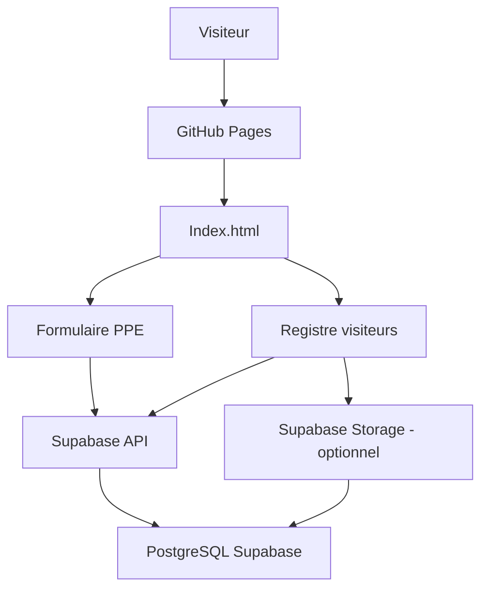

# HSE School - Guide complet du projet


Application web HSE pour l'accueil des visiteurs de l'usine Holcim Oggaz.

Le projet permet de :

- presenter les consignes de securite du site ;
- afficher les EPI obligatoires ;
- diffuser la video d'induction HSE ;
- enregistrer une demande d'equipement PPE ;
- enregistrer l'arrivee et le depart d'un visiteur avec signature numerique ;
- proposer plusieurs langues : anglais, francais, arabe, espagnol et chinois.

## 1. Architecture du projet



GitHub Pages heberge uniquement la page web. Les donnees sont enregistrees dans Supabase via son API. Les identifiants SQL ne doivent jamais etre exposes dans le code HTML.

## 2. Fichiers du projet

```text
TEST HSE SCHOOL/
|-- Index.html
|-- Holcim-Group-logo-PNG.png
|-- database.sql
`-- GUIDE_PROJET.md
```

### Role des fichiers

| Fichier | Role |
| --- | --- |
| `Index.html` | Interface, navigation, traductions et formulaires |
| `Holcim-Group-logo-PNG.png` | Logo utilise dans l'en-tete et le pied de page |
| `database.sql` | Structure PostgreSQL pour Supabase |
| `GUIDE_PROJET.md` | Documentation du projet |

## 3. Prerequis

Installer ou creer les comptes suivants :

- un compte GitHub ;
- un compte Supabase ;
- un navigateur moderne ;
- Git, si le depot doit etre gere en ligne de commande.

Aucune connexion SQL directe ne doit etre faite depuis GitHub Pages.

## 4. Creer le projet Supabase

1. Ouvrir [https://supabase.com](https://supabase.com).
2. Creer un compte ou se connecter.
3. Cliquer sur **New project**.
4. Donner le nom `hse-school`.
5. Choisir une region proche des utilisateurs.
6. Definir un mot de passe SQL fort.
7. Attendre la fin de la creation du projet.

## 5. Creer la base de donnees

1. Dans Supabase, ouvrir **SQL Editor**.
2. Cliquer sur **New query**.
3. Copier tout le contenu de `database.sql`.
4. Cliquer sur **Run**.
5. Ouvrir **Table Editor** et verifier les tables suivantes :

```text
visitor_registrations
ppe_requests
ppe_request_items
```

### Tables creees

#### `visitor_registrations`

Enregistre :

- nom complet ;
- email ;
- adresse ;
- motif de la visite ;
- details ;
- date d'arrivee ;
- date de depart prevue ;
- signature numerique ;
- statut ;
- dates de creation et de modification.

#### `ppe_requests`

Enregistre :

- nom du demandeur ;
- societe ;
- email ;
- date de retrait ;
- statut ;
- dates de creation et de modification.

#### `ppe_request_items`

Enregistre chaque EPI demande et sa taille lorsqu'elle est necessaire.

## 6. Activer la securite Supabase

Dans le **SQL Editor**, executer :

```sql
ALTER TABLE visitor_registrations ENABLE ROW LEVEL SECURITY;
ALTER TABLE ppe_requests ENABLE ROW LEVEL SECURITY;
ALTER TABLE ppe_request_items ENABLE ROW LEVEL SECURITY;
```

Les deux formulaires publics passent par des fonctions SQL securisees :

```sql
REVOKE INSERT, SELECT, UPDATE, DELETE ON visitor_registrations FROM anon;
REVOKE INSERT, SELECT, UPDATE, DELETE ON ppe_requests FROM anon;
REVOKE INSERT, SELECT, UPDATE, DELETE ON ppe_request_items FROM anon;

GRANT EXECUTE ON FUNCTION public.submit_visitor_registration(
    VARCHAR, VARCHAR, TEXT, VARCHAR, TEXT, TIMESTAMPTZ, TIMESTAMPTZ, TEXT
) TO anon;

GRANT EXECUTE ON FUNCTION public.submit_ppe_request(
    VARCHAR, VARCHAR, VARCHAR, DATE, JSONB
) TO anon;
```

Les demandes PPE sont enregistrees par `submit_ppe_request` et les visites par `submit_visitor_registration`. Il ne faut pas creer de policy `WITH CHECK (true)` pour ces insertions publiques.

### Securite recommandee pour la production

Pour la version finale :

- ne jamais utiliser la cle `service_role` dans `Index.html` ;
- utiliser uniquement la cle `anon public` cote navigateur ;
- ajouter une Edge Function Supabase pour valider les donnees ;
- limiter le nombre d'envois par adresse IP ;
- proteger la consultation des donnees par authentification ;
- ne pas autoriser les visiteurs anonymes a lire les tables ;
- stocker les signatures dans Supabase Storage plutot qu'en base64 dans SQL.

## 7. Recuperer les cles Supabase

Dans Supabase :

1. Ouvrir **Project Settings**.
2. Ouvrir **API**.
3. Copier :

```text
Project URL
anon public key
```

Ajouter ensuite le client Supabase dans `Index.html`, avant le code applicatif :

```html
<script src="https://cdn.jsdelivr.net/npm/@supabase/supabase-js@2"></script>
<script>
    const SUPABASE_URL = 'https://VOTRE-PROJET.supabase.co';
    const SUPABASE_ANON_KEY = 'VOTRE_CLE_ANON_PUBLIC';

    const supabaseClient = supabase.createClient(
        SUPABASE_URL,
        SUPABASE_ANON_KEY
    );
</script>
```

Remplacer les valeurs d'exemple par celles du projet Supabase.

## 8. Connecter le formulaire PPE

Le formulaire PPE collecte les champs suivants :

```javascript
const formData = {
    nom,
    societe,
    email,
    dateRetrait,
    equipments
};
```

La demande PPE doit passer par la fonction SQL securisee :

```javascript
const items = formData.equipments.map((equipment) => ({
    item_code: equipment.code,
    item_label: equipment.item,
    size: equipment.size || null
}));

const { error } = await supabaseClient.rpc('submit_ppe_request', {
    p_full_name: formData.nom,
    p_company_name: formData.societe,
    p_email: formData.email,
    p_pickup_date: formData.dateRetrait,
    p_items: items
});

if (error) {
    throw error;
}
```

Les codes autorises sont :

```text
helmet
shoes
vest
glasses
hearing_protection
dust_mask
```

## 9. Connecter le registre visiteurs

Le registre collecte :

```javascript
const formData = {
    nom,
    adresse,
    email,
    arrivee,
    depart,
    motif,
    motifDetails,
    signature
};
```

Enregistrer le visiteur avec la fonction RPC securisee :

```javascript
const { error } = await supabaseClient.rpc('submit_visitor_registration', {
    p_full_name: formData.nom,
    p_email: formData.email,
    p_address: formData.adresse,
    p_visit_purpose: formData.motif,
    p_visit_details: formData.motifDetails,
    p_arrival_at: new Date(formData.arrivee).toISOString(),
    p_planned_departure_at: new Date(formData.depart).toISOString(),
    p_signature_data: formData.signature
});

if (error) {
    throw error;
}
```

Le formulaire doit afficher un message de succes uniquement apres une reponse positive de Supabase.

## 10. Gestion de la signature

La version actuelle transforme la signature canvas en image PNG base64 avec :

```javascript
canvas.toDataURL('image/png');
```

Cette valeur peut etre enregistree temporairement dans `signature_data`.

Pour la production, il est preferable de :

1. convertir le canvas en Blob ;
2. televerser le fichier dans Supabase Storage ;
3. enregistrer uniquement le chemin du fichier dans la table SQL ;
4. rendre le bucket prive ;
5. utiliser des URL signees pour la consultation.

## 11. Tester localement

Tester chaque fonctionnalite :

### Interface

- la page d'accueil s'affiche ;
- le logo Holcim apparait ;
- les quatre onglets fonctionnent ;
- le menu mobile fonctionne ;
- les cinq langues fonctionnent ;
- le mode arabe passe bien en RTL.

### Formulaire PPE

- les champs obligatoires sont controles ;
- au moins un EPI doit etre selectionne ;
- la taille apparait pour les chaussures ;
- la taille apparait pour le gilet ;
- une demande est visible dans `ppe_requests` ;
- les EPI sont visibles dans `ppe_request_items`.

### Registre visiteurs

- la signature est obligatoire ;
- la date de depart est apres la date d'arrivee ;
- l'adresse email est valide ;
- la signature est enregistree ;
- la ligne apparait dans `visitor_registrations`.

## 12. Publier sur GitHub

### Creer le depot

1. Sur GitHub, cliquer sur **New repository**.
2. Nom conseille : `hse-school-oggaz`.
3. Choisir **Public** si GitHub Pages gratuit est utilise.
4. Ne pas ajouter un autre fichier `README` si le projet en contient deja un.

### Envoyer les fichiers

Les fichiers a publier sont :

```text
Index.html
Holcim-Group-logo-PNG.png
database.sql
GUIDE_PROJET.md
```

### Activer GitHub Pages

1. Ouvrir **Settings** du depot.
2. Ouvrir **Pages**.
3. Dans **Build and deployment**, choisir **Deploy from a branch**.
4. Choisir la branche `main`.
5. Choisir le dossier `/root`.
6. Cliquer sur **Save**.

L'adresse sera similaire a :

```text
https://VOTRE_COMPTE.github.io/hse-school-oggaz/
```

## 13. Points a verifier avant la mise en production

- [ ] L'URL Supabase est correcte.
- [ ] La cle utilisee est uniquement `anon public`.
- [ ] Les politiques RLS sont activees.
- [ ] Aucune cle secrete n'est presente dans le depot GitHub.
- [ ] Les formulaires n'utilisent plus la simulation locale.
- [ ] Les erreurs Supabase sont affichees proprement.
- [ ] Les donnees personnelles sont protegees.
- [ ] La signature n'est pas exposee publiquement.
- [ ] La video Google Drive est accessible publiquement ou remplacee par une ressource stable.
- [ ] Les images externes de l'usine sont accessibles.
- [ ] Le site est teste sur mobile.
- [ ] Le site est teste en anglais, francais et arabe.

## 14. Depannage

### Les donnees ne sont pas enregistrees

Verifier :

1. l'URL Supabase ;
2. la cle `anon public` ;
3. les politiques RLS ;
4. les noms des colonnes ;
5. la console du navigateur.

### Erreur RLS

Une erreur `new row violates row-level security policy` signifie qu'une politique `INSERT` manque ou ne correspond pas a la table concernee.

### Erreur CORS

Verifier que l'URL utilisee est bien l'URL officielle Supabase et que la requete est envoyee en HTTPS depuis GitHub Pages.

### La video ne s'affiche pas

Le fichier Google Drive doit etre partage avec les autorisations permettant sa lecture dans un iframe. Une video hebergee sur Supabase Storage ou YouTube non liste peut etre plus fiable.

## 15. Evolution conseillee

### Version 1 - Prototype

- GitHub Pages ;
- Supabase Database ;
- formulaires publics ;
- affichage des confirmations.

### Version 2 - Administration

- authentification Supabase ;
- tableau de bord HSE ;
- recherche des visiteurs ;
- validation des demandes PPE ;
- export CSV ou Excel ;
- changement des statuts.

### Version 3 - Production

- Edge Functions ;
- Supabase Storage pour les signatures ;
- limitation anti-spam ;
- journalisation ;
- sauvegardes ;
- politique de conservation des donnees ;
- nom de domaine personnalise.

## 16. Resultat attendu

Le parcours final doit etre :

```text
1. Le visiteur ouvre la page GitHub Pages.
2. Il lit les consignes de securite.
3. Il consulte les EPI obligatoires.
4. Il regarde la video d'induction.
5. Il remplit le registre visiteurs.
6. Il signe avec la souris ou son telephone.
7. Supabase enregistre la visite.
8. Le service HSE peut consulter et traiter les donnees.
```
